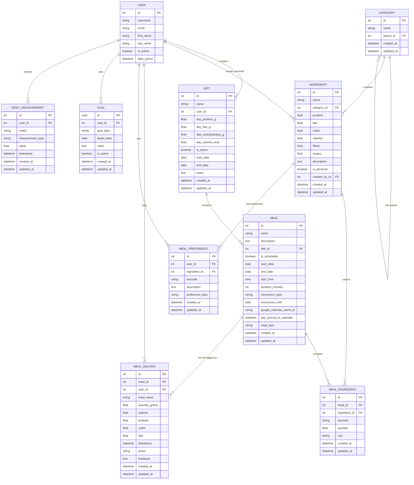

# FitHub Architecture Documentation

## 🏗️ System Architecture Overview

FitHub is built as a modern, scalable REST API using Django REST Framework with a focus on maintainability, testability, and deployment automation.

## 🔑 Key Architectural Decisions

### Technology Choices

1. **Django REST Framework**: Chosen for its mature ecosystem, built-in authentication, and excellent API tooling
2. **PostgreSQL**: Selected for ACID compliance, JSON support, and excellent Django integration
3. **JWT Authentication**: Primary authentication method for stateless API access
4. **uv Package Manager**: Fast Python package manager for improved development experience
5. **Docker**: Containerization for consistent deployment across environments
6. **pytest + testcontainers**: Modern testing approach with real database containers

### Design Patterns

1. **API-First Design**: Pure REST API without template dependencies
2. **ViewSet Pattern**: Consistent CRUD operations across all resources
3. **Factory Pattern**: Test data generation using factory-boy
4. **Container Pattern**: Database testing with testcontainers
5. **Pre-commit Hooks**: Automated code quality enforcement

## 📊 High-Level Architecture

### System Overview
```
┌─────────────────────────────────────────────────────────────┐
│                    FitHub System Architecture               │
└─────────────────────────────────────────────────────────────┘

┌─────────────────┐    ┌─────────────────┐    ┌─────────────────┐
│   Client Apps   │    │   API Gateway   │    │   Data Layer    │
│                 │    │                 │    │                 │
│ • Web Frontend  │◄──►│ • Django DRF    │◄──►│ • PostgreSQL    │
│ • Mobile App    │    │ • Authentication│    │ • Redis Cache   │
│ • Third-party   │    │ • Rate Limiting │    │ • File Storage  │
└─────────────────┘    └─────────────────┘    └─────────────────┘
                              │
                              ▼
                       ┌─────────────────┐
                       │   Infrastructure│
                       │                 │
                       │ • Docker        │
                       │ • CI/CD         │
                       │ • Monitoring    │
                       └─────────────────┘
```

### C4 Deployment Architecture

For detailed deployment architecture including production, staging, and development environments, see the comprehensive C4 deployment diagram:

**📋 [C4 Deployment Diagram](C4_DEPLOYMENT.md)**

The C4 deployment diagram provides:
- **Production Environment**: Load balancer, application cluster, database cluster, monitoring
- **Local Development**: Docker containers for web app and PostgreSQL
- **CI/CD Pipeline**: GitHub Actions, Docker Hub registry
- **Technology Stack**: Detailed technology choices and configurations
- **Security Architecture**: Network, application, and data security layers

**🔄 [CI Pipeline Architecture](CI_PIPELINE.md)**

The CI pipeline documentation provides:
- **4-Stage Pipeline**: Detailed flow from code commit to deployment
- **Quality Gates**: Code quality, security, testing, and build requirements
- **Job Dependencies**: Parallel and sequential job execution patterns
- **Technology Stack**: CI/CD tools and configurations
- **Monitoring**: Pipeline metrics and observability

## 🏛️ Application Architecture

### Django Project Structure

```
fithub/                          # Main Django project
├── fithub/                      # Project configuration
│   ├── settings.py             # Production settings
│   ├── test_settings.py        # PostgreSQL test settings
│   ├── test_settings_sqlite.py # SQLite test settings
│   ├── urls.py                 # Main URL routing
│   ├── wsgi.py                 # WSGI configuration
│   └── asgi.py                 # ASGI configuration
├── nutrition/                   # Nutrition tracking app
├── goals/                       # Goals management app
├── home/                        # Home page app
└── fitbot/                      # Placeholder app
```

### App Architecture Pattern

Each Django app follows a consistent structure:

```
app_name/
├── models.py           # Database models
├── serializers.py      # API serializers
├── api.py             # API viewsets and views
├── api_urls.py        # API URL routing
├── factories.py       # Test data factories
├── test_api.py        # API tests
├── admin.py           # Django admin configuration
├── apps.py            # App configuration
├── migrations/        # Database migrations
└── tests.py           # Basic tests
```

## 📦 Dependencies & Package Management

### Core Dependencies

#### Production Dependencies
```toml
dependencies = [
    "django>=5.2.7",                    # Web framework
    "djangorestframework>=3.16.1",      # API framework
    "djangorestframework-simplejwt>=5.5.1", # JWT authentication
    "django-filter>=24.2",              # API filtering
    "django-cors-headers>=4.3.1",       # CORS handling
    "drf-spectacular>=0.27.0",          # OpenAPI documentation
    "pillow>=11.3.0",                   # Image processing
    "psycopg2-binary>=2.9.10",          # PostgreSQL adapter
    "python-dotenv>=1.1.1",             # Environment variables
]
```

#### Development Dependencies
```toml
test = [
    "pytest>=8.0.0",                    # Testing framework
    "pytest-django>=4.8.0",             # Django testing integration
    "pytest-cov>=4.0.0",                # Coverage reporting
    "factory-boy>=3.3.0",               # Test data factories
    "faker>=22.0.0",                    # Fake data generation
    "testcontainers>=3.7.0",            # Database containers
    "docker>=6.1.0",                    # Docker integration
    "black>=23.0.0",                    # Code formatting
    "isort>=5.12.0",                    # Import sorting
    "flake8>=6.0.0",                    # Linting
    "bandit>=1.7.0",                    # Security analysis
    "safety>=2.3.0",                    # Dependency vulnerability scanning
]

dev = [
    "pre-commit>=4.3.0",                # Git hooks
]
```

### Package Management Strategy

#### uv Package Manager
- **Why uv**: Significantly faster than pip, better dependency resolution
- **Lock File**: `uv.lock` ensures reproducible builds
- **Virtual Environment**: Automatic `.venv` management
- **Commands**: `uv sync`, `uv add`, `uv run`

#### Dependency Groups
- **Production**: Core runtime dependencies
- **Test**: Testing and quality assurance tools
- **Dev**: Development workflow tools

### Authentication Architecture

#### Multi-Method Authentication
1. **JWT (Primary)**: Stateless, scalable for API clients
   - Access tokens: 60 minutes
   - Refresh tokens: 7 days
   - Token rotation enabled

2. **Session Authentication**: For web browser clients
   - CSRF protection enabled
   - Session-based state management

3. **Token Authentication**: DRF tokens for simple API access
   - Returns user information with token
   - Suitable for server-to-server communication

## 🗄️ Data Architecture

### Database Design

#### Entity Relationship Diagram



#### Core Entities

1. **User Management**
   - `User` (Django built-in)
   - Authentication via JWT, sessions, and tokens

2. **Nutrition Domain**
   ```
   Category ──┐
              ├── Ingredient ──┐
   Diet ──────┤                ├── MealIngredient
              └── Meal ────────┘
                              │
                              └── MealRecord
   ```

3. **Goals Domain**
   ```
   Goal ──┐
          └── BodyMeasurement
   ```

#### Key Relationships

- **User Ownership**: All user-specific models have a `user` foreign key
- **Nutrition Hierarchy**: Categories → Ingredients → Meals → MealRecords
- **Goal Tracking**: Goals → BodyMeasurements for progress tracking
- **Flexible Meal Recording**: MealRecord can reference planned meals or be standalone
- **Preference System**: MealPreference allows users to express ingredient preferences

### Database Models

#### Nutrition Models

```python
# Category: Food categories (e.g., "Vegetables", "Proteins")
class Category(models.Model):
    name = models.CharField(max_length=100)
    description = models.TextField(blank=True)

# Ingredient: Individual food items with nutritional data
class Ingredient(models.Model):
    name = models.CharField(max_length=200)
    category = models.ForeignKey(Category, on_delete=models.CASCADE)
    calories_per_100g = models.DecimalField(max_digits=8, decimal_places=2)
    # ... other nutritional fields

# Diet: Collection of meals for a specific goal
class Diet(models.Model):
    name = models.CharField(max_length=200)
    user = models.ForeignKey(User, on_delete=models.CASCADE)
    start_date = models.DateField()
    end_date = models.DateField(null=True, blank=True)
    is_active = models.BooleanField(default=True)

# Meal: Collection of ingredients
class Meal(models.Model):
    name = models.CharField(max_length=200)
    diet = models.ForeignKey(Diet, on_delete=models.CASCADE, null=True)
    user = models.ForeignKey(User, on_delete=models.CASCADE)
    meal_type = models.CharField(max_length=50, choices=MEAL_TYPE_CHOICES)

# MealIngredient: Junction table for meal-ingredient relationships
class MealIngredient(models.Model):
    meal = models.ForeignKey(Meal, on_delete=models.CASCADE)
    ingredient = models.ForeignKey(Ingredient, on_delete=models.CASCADE)
    quantity = models.DecimalField(max_digits=8, decimal_places=2)
    unit = models.CharField(max_length=20)

# MealRecord: Actual consumption records
class MealRecord(models.Model):
    user = models.ForeignKey(User, on_delete=models.CASCADE)
    meal = models.ForeignKey(Meal, on_delete=models.CASCADE, null=True)
    timestamp = models.DateTimeField()
    calories = models.DecimalField(max_digits=8, decimal_places=2)
```

#### Goals Models

```python
# Goal: Fitness goals (weight loss, muscle gain, etc.)
class Goal(models.Model):
    user = models.ForeignKey(User, on_delete=models.CASCADE)
    title = models.CharField(max_length=200)
    description = models.TextField(blank=True)
    goal_type = models.CharField(max_length=50, choices=GOAL_TYPE_CHOICES)
    target_value = models.DecimalField(max_digits=10, decimal_places=2)
    start_date = models.DateField()
    target_date = models.DateField()
    is_active = models.BooleanField(default=True)

# BodyMeasurement: Physical measurements over time
class BodyMeasurement(models.Model):
    user = models.ForeignKey(User, on_delete=models.CASCADE)
    metric = models.CharField(max_length=50, choices=METRIC_CHOICES)
    value = models.DecimalField(max_digits=8, decimal_places=2)
    unit = models.CharField(max_length=20)
    timestamp = models.DateTimeField()
```

## 🔌 API Architecture

### RESTful Design Principles

- **Resource-based URLs**: `/api/nutrition/diets/`, `/api/goals/body-measurements/`
- **HTTP Methods**: GET, POST, PUT, PATCH, DELETE
- **Status Codes**: Proper HTTP status codes for all responses
- **Content Negotiation**: JSON responses with proper headers

### API Structure

#### ViewSet Pattern

```python
class DietViewSet(viewsets.ModelViewSet):
    """
    ViewSet for managing diets with full CRUD operations
    """
    queryset = Diet.objects.all()
    serializer_class = DietSerializer
    permission_classes = [IsAuthenticated]
    filter_backends = [DjangoFilterBackend, SearchFilter, OrderingFilter]
    filterset_fields = ['is_active', 'start_date', 'end_date']
    search_fields = ['name', 'description']
    ordering_fields = ['created_at', 'start_date', 'name']
    ordering = ['-created_at']
```

#### Custom Actions

```python
@action(detail=True, methods=['post'])
def activate(self, request, pk=None):
    """Activate a diet"""
    diet = self.get_object()
    diet.is_active = True
    diet.save()
    return Response({'status': 'diet activated'})
```

### Authentication & Authorization

#### Authentication Methods

1. **Session Authentication**: For web clients
2. **Token Authentication**: For API clients
3. **CSRF Protection**: Enabled for session authentication

#### Permission System

- **IsAuthenticated**: All API endpoints require authentication
- **User Ownership**: Users can only access their own data
- **Admin Access**: Superusers have full access via Django admin

### API Documentation

#### OpenAPI/Swagger Integration

- **drf-spectacular**: Auto-generates OpenAPI 3.0 schema
- **Swagger UI**: Interactive API documentation at `/api/docs/`
- **ReDoc**: Alternative documentation at `/api/redoc/`
- **Schema Endpoint**: Raw OpenAPI schema at `/api/schema/`

## 🧪 Testing Architecture

### Testing Strategy

#### Test Types

1. **Unit Tests**: Individual component testing
2. **Integration Tests**: API endpoint testing
3. **Container Tests**: Database integration with PostgreSQL containers

#### Test Structure

```python
class NutritionAPITestCase(APITestCase):
    def setUp(self):
        """Set up test data"""
        self.client = APIClient()
        self.user = UserFactory()
        self.client.force_authenticate(user=self.user)
    
    def test_diet_create(self):
        """Test diet creation"""
        data = {
            'name': 'Test Diet',
            'description': 'Test description',
            'start_date': '2025-01-01'
        }
        response = self.client.post('/api/nutrition/diets/', data)
        self.assertEqual(response.status_code, status.HTTP_201_CREATED)
```

#### Test Data Management

- **factory-boy**: Generates realistic test data
- **faker**: Creates fake but realistic data
- **testcontainers**: Provides isolated PostgreSQL instances

### Test Configuration

#### Multiple Test Environments

1. **SQLite Tests** (`test_settings_sqlite.py`): Fast, in-memory database
2. **PostgreSQL Tests** (`test_settings.py`): Real database with containers
3. **Production Tests** (`settings.py`): Full production environment

## 🐳 Deployment Architecture

### Containerization

#### Docker Configuration

```dockerfile
FROM python:3.13-slim

# Install system dependencies
RUN apt-get update && apt-get install -y \
    postgresql-client \
    && rm -rf /var/lib/apt/lists/*

# Set working directory
WORKDIR /app

# Install Python dependencies
COPY pyproject.toml uv.lock ./
RUN pip install uv && uv sync

# Copy application code
COPY . .

# Set entrypoint
ENTRYPOINT ["/app/entrypoint.sh"]
```

#### Multi-Platform Support

- **linux/amd64**: Standard x86_64 architecture
- **linux/arm64**: ARM64 architecture (Apple Silicon, ARM servers)

### CI/CD Pipeline

#### Pipeline Stages

1. **Code Quality** (Parallel)
   - Linting (flake8)
   - Security scanning (bandit, safety)
   - Code formatting (black, isort)

2. **Testing**
   - Unit tests with PostgreSQL containers
   - Coverage reporting
   - Test result artifacts

3. **Docker Build**
   - Multi-platform builds
   - DockerHub push
   - Image testing

4. **Deployment**
   - Production deployment (main branch only)
   - Environment-specific configurations

#### GitHub Actions Workflow

```yaml
jobs:
  lint:
    runs-on: ubuntu-latest
    steps:
      - uses: actions/checkout@v4
      - name: Run linting
        run: make lint
  
  test:
    runs-on: ubuntu-latest
    needs: [lint, security]
    services:
      postgres:
        image: postgres:16
    steps:
      - name: Run tests
        run: make test-ci
```

## 🔒 Security Architecture

### Security Measures

#### Authentication Security

- **CSRF Protection**: Enabled for session authentication
- **Token Authentication**: Secure API token system
- **Password Hashing**: Django's built-in PBKDF2 with SHA256

#### Data Security

- **User Isolation**: Users can only access their own data
- **Input Validation**: Comprehensive serializer validation
- **SQL Injection Protection**: Django ORM prevents SQL injection

#### Security Scanning

- **bandit**: Static security analysis
- **safety**: Dependency vulnerability scanning
- **Automated Scanning**: Integrated into CI/CD pipeline

## 📈 Performance Architecture

### Performance Optimizations

#### Database Optimization

- **Select Related**: Minimize database queries
- **Pagination**: Limit result sets
- **Indexing**: Proper database indexes on foreign keys

#### Caching Strategy

- **Database Query Caching**: Django's built-in caching
- **API Response Caching**: Future enhancement with Redis

#### Scalability Considerations

- **Stateless Design**: API is stateless for horizontal scaling
- **Database Connection Pooling**: PostgreSQL connection management
- **Container Orchestration**: Ready for Kubernetes deployment

## 🔄 Development Workflow

### Code Quality

#### Automated Checks

- **Formatting**: black and isort for consistent code style
- **Linting**: flake8 for code quality
- **Type Checking**: Future enhancement with mypy
- **Security**: bandit and safety for vulnerability scanning

#### Development Commands

```bash
# Code formatting
make format

# Linting
make lint

# Security checks
make security

# Testing
make test-fast    # SQLite tests
make test         # PostgreSQL tests
make test-ci      # CI-style tests with coverage
```

### Git Workflow

1. **Feature Branches**: All development on feature branches
2. **Pull Requests**: Code review via pull requests
3. **CI Checks**: All checks must pass before merge
4. **Main Branch**: Production-ready code only

## 🚀 Future Architecture Considerations

### Scalability Enhancements

- **Microservices**: Split into domain-specific services
- **Message Queues**: Celery for background tasks
- **Caching Layer**: Redis for session and data caching
- **CDN**: Static file delivery optimization

### Monitoring & Observability

- **Application Monitoring**: APM tools integration
- **Logging**: Structured logging with ELK stack
- **Metrics**: Prometheus and Grafana integration
- **Health Checks**: Comprehensive health monitoring

### API Enhancements

- **GraphQL**: Alternative to REST API
- **WebSocket**: Real-time updates
- **Rate Limiting**: API usage controls
- **API Versioning**: Backward compatibility management
