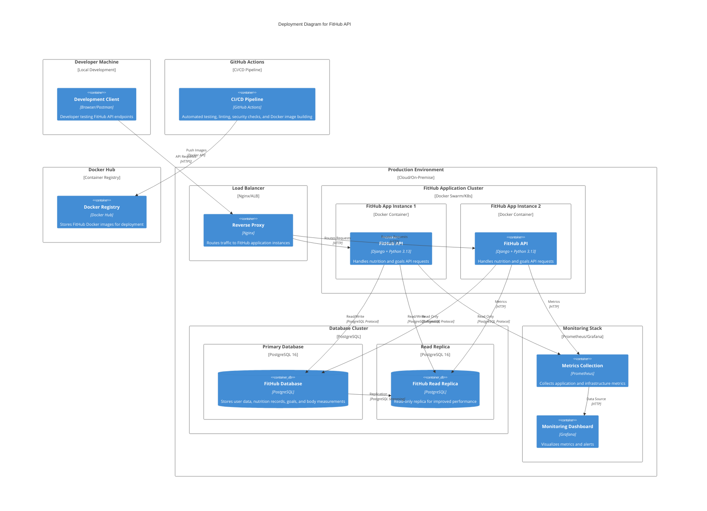
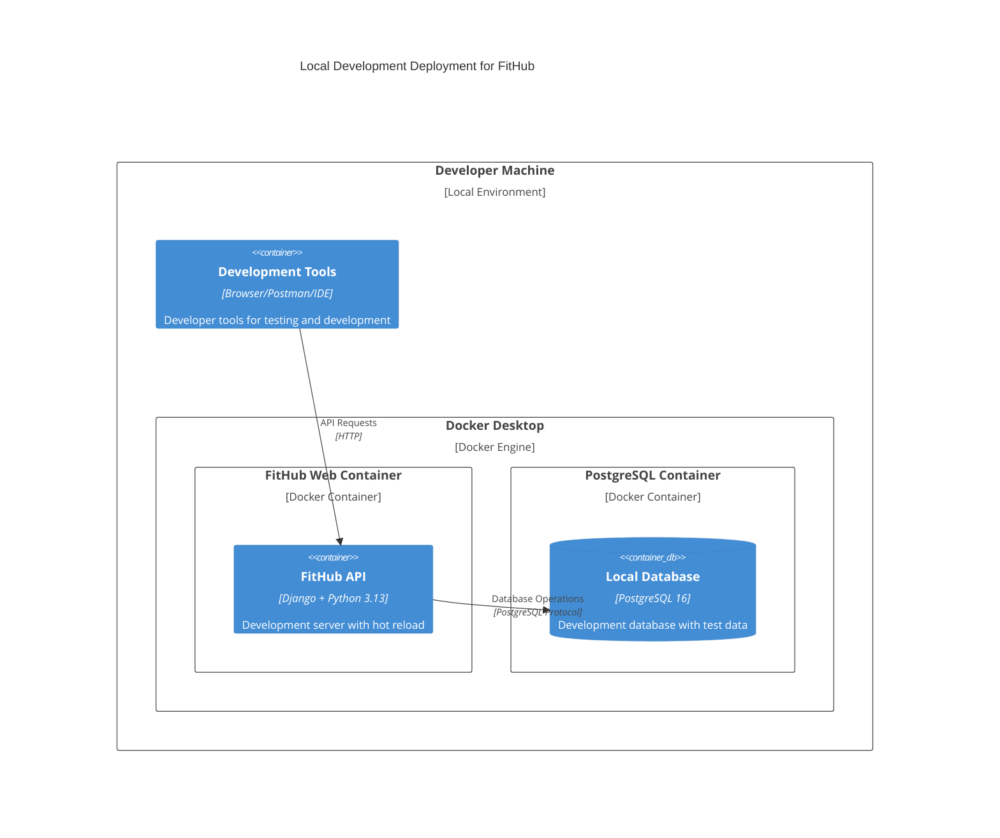

# FitHub C4 Deployment Diagram

## 🏗️ C4 Deployment Architecture

This document provides a C4-style deployment diagram for the FitHub fitness and nutrition tracking API.

## 📊 Deployment Diagram

## 🏗️ Local Development Deployment

## 🔧 Technology Stack Details

### Application Layer
- **Framework**: Django 5.2+ with Django REST Framework
- **Language**: Python 3.13+
- **Package Manager**: uv (fast Python package manager)
- **Authentication**: JWT (djangorestframework-simplejwt)
- **API Documentation**: drf-spectacular (OpenAPI/Swagger)

### Database Layer
- **Primary Database**: PostgreSQL 16
- **Connection Pooling**: Built-in Django connection pooling
- **Migrations**: Django migrations with version control
- **Backup Strategy**: Automated PostgreSQL backups

### Infrastructure Layer
- **Containerization**: Docker with multi-stage builds
- **Orchestration**: Docker Compose (dev) / Docker Swarm or Kubernetes (prod)
- **Load Balancing**: Nginx or AWS Application Load Balancer
- **Monitoring**: Prometheus + Grafana
- **CI/CD**: GitHub Actions with automated testing

### Security Layer
- **HTTPS**: TLS termination at load balancer
- **Authentication**: JWT tokens with refresh mechanism
- **Authorization**: Django permissions and DRF permissions
- **Security Scanning**: Bandit and Safety in CI/CD pipeline

## 📋 Deployment Environments

### Development Environment
- **Purpose**: Local development and testing
- **Database**: PostgreSQL container with test data
- **Features**: Hot reload, debug mode, detailed error pages
- **Access**: `http://localhost:8000`

### Staging Environment
- **Purpose**: Pre-production testing
- **Database**: PostgreSQL with production-like data
- **Features**: Production-like configuration, monitoring
- **Access**: Staging URL with authentication

### Production Environment
- **Purpose**: Live application serving users
- **Database**: PostgreSQL cluster with replication
- **Features**: High availability, monitoring, backups
- **Access**: Production domain with SSL

## 🚀 Deployment Process

### Automated Deployment (CI/CD)
1. **Code Push**: Developer pushes to main branch
2. **CI Pipeline**: GitHub Actions runs tests, linting, security checks
3. **Build**: Docker image built and pushed to registry
4. **Deploy**: Automated deployment to staging/production
5. **Health Check**: Automated health checks and rollback if needed

### Manual Deployment
1. **Build Image**: `docker build -t fithub:latest .`
2. **Push to Registry**: `docker push fithub:latest`
3. **Deploy**: Update container orchestration
4. **Verify**: Check application health and logs

## 📊 Monitoring and Observability

### Metrics Collection
- **Application Metrics**: Django metrics via Prometheus
- **Database Metrics**: PostgreSQL performance metrics
- **Infrastructure Metrics**: Container and host metrics

### Logging
- **Application Logs**: Django logging with structured format
- **Access Logs**: Nginx access and error logs
- **Database Logs**: PostgreSQL query and error logs

### Alerting
- **Health Checks**: Automated health monitoring
- **Performance Alerts**: Response time and error rate monitoring
- **Resource Alerts**: CPU, memory, and disk usage monitoring

## 🔒 Security Considerations

### Network Security
- **Firewall**: Restrict access to necessary ports only
- **VPC**: Private network for database and internal services
- **SSL/TLS**: End-to-end encryption for all communications

### Application Security
- **Authentication**: JWT tokens with secure storage
- **Authorization**: Role-based access control
- **Input Validation**: Comprehensive input sanitization
- **Security Headers**: CORS, CSRF, and security headers

### Data Security
- **Encryption**: Data encryption at rest and in transit
- **Backup Security**: Encrypted backups with access controls
- **Audit Logging**: Comprehensive audit trail for all operations
