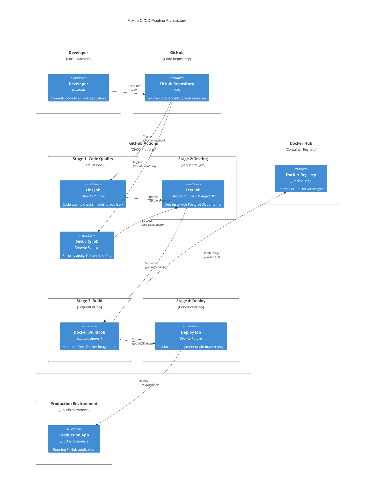
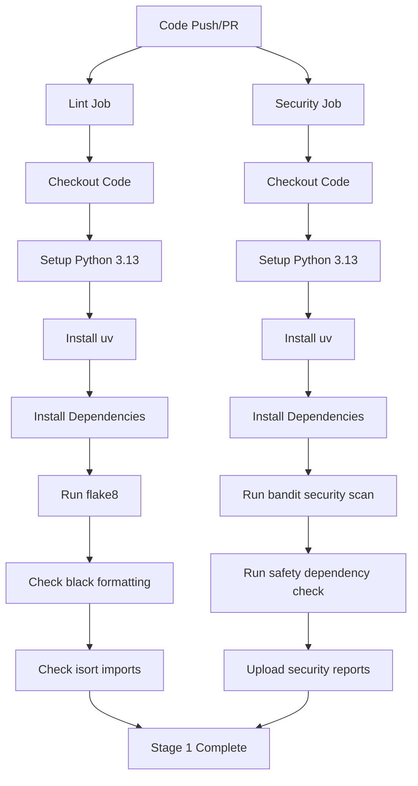
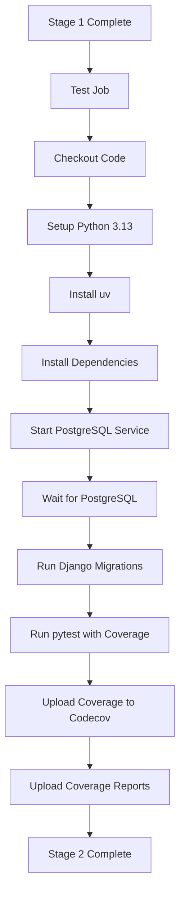
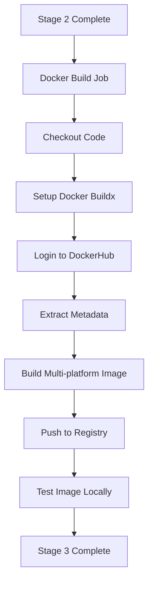
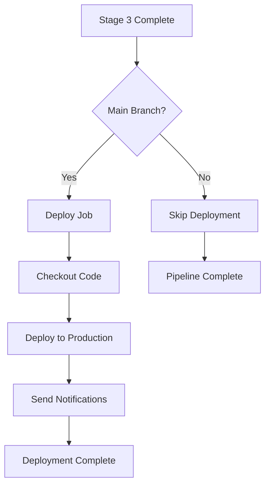

# FitHub CI/CD Pipeline Architecture

## 🔄 CI/CD Pipeline Overview

This document provides a detailed view of the FitHub CI/CD pipeline architecture, showing the complete flow from code commit to deployment.

## 📊 CI Pipeline Flow Diagram



## 🔄 Detailed Pipeline Stages

### Stage 1: Code Quality Checks (Parallel)



### Stage 2: Testing (Sequential)



### Stage 3: Docker Build (Sequential)



### Stage 4: Deployment (Conditional)



## 🛠️ Pipeline Configuration Details

### Trigger Conditions
- **Push Events**: `main` and `develop` branches
- **Pull Request Events**: Targeting `main` and `develop` branches

### Job Dependencies
```yaml
Stage 1 (Parallel):
├── lint: Code quality checks
└── security: Security analysis

Stage 2 (Sequential):
└── test: depends on [lint, security]

Stage 3 (Sequential):
└── docker-build: depends on test

Stage 4 (Conditional):
└── deploy: depends on [lint, security, test, docker-build]
    └── Only runs on main branch pushes
```

### Technology Stack

#### CI/CD Platform
- **Platform**: GitHub Actions
- **Runners**: Ubuntu Latest
- **Python Version**: 3.13
- **Package Manager**: uv (latest)

#### Code Quality Tools
- **Linting**: flake8 with complexity and line length checks
- **Formatting**: black (127 character line length)
- **Import Sorting**: isort
- **Security**: bandit (static analysis) + safety (dependency vulnerabilities)

#### Testing Infrastructure
- **Test Framework**: pytest with Django integration
- **Database**: PostgreSQL 16 (GitHub Actions service)
- **Coverage**: pytest-cov with HTML and XML reports
- **Coverage Upload**: Codecov integration

#### Container Build
- **Platform**: Docker Buildx
- **Multi-platform**: linux/amd64, linux/arm64
- **Registry**: Docker Hub
- **Caching**: GitHub Actions cache
- **Image Testing**: Local container validation

## 📊 Pipeline Metrics

### Typical Execution Times
- **Lint Job**: ~13 seconds
- **Security Job**: ~19 seconds
- **Test Job**: ~54 seconds
- **Docker Build**: ~1 minute 8 seconds
- **Deploy Job**: ~5 seconds

### Total Pipeline Time
- **Full Pipeline**: ~2 minutes 39 seconds
- **Parallel Stage 1**: ~19 seconds (longest of lint/security)
- **Sequential Stages**: ~2 minutes 20 seconds

## 🔒 Security & Quality Gates

### Code Quality Gates
- ✅ **Linting**: No flake8 errors or warnings
- ✅ **Formatting**: Code properly formatted with black
- ✅ **Imports**: Imports properly sorted with isort
- ✅ **Complexity**: Maximum complexity of 10
- ✅ **Line Length**: Maximum 127 characters

### Security Gates
- ✅ **Static Analysis**: No bandit security issues
- ✅ **Dependencies**: No known vulnerabilities (safety)
- ✅ **Timeout Protection**: 5-minute timeout on security scans

### Testing Gates
- ✅ **Test Coverage**: Minimum coverage maintained
- ✅ **All Tests Pass**: No failing unit tests
- ✅ **Database Integration**: PostgreSQL integration tests pass
- ✅ **Migration Validation**: Database migrations work correctly

### Build Gates
- ✅ **Docker Build**: Multi-platform image builds successfully
- ✅ **Image Testing**: Container starts and basic checks pass
- ✅ **Registry Push**: Image successfully pushed to Docker Hub

### Deployment Gates
- ✅ **Branch Protection**: Only main branch deploys to production
- ✅ **All Stages Pass**: All previous stages must succeed
- ✅ **Manual Approval**: Deployment requires all quality gates

## 🚀 Deployment Strategy

### Branch Strategy
- **main**: Production branch (auto-deploy on push)
- **develop**: Development branch (build and test only)
- **feature/***: Feature branches (build and test only)

### Image Tagging Strategy
- **latest**: Latest main branch build
- **main**: Current main branch
- **develop**: Current develop branch
- **pr-{number}**: Pull request builds
- **semver**: Semantic version tags

### Rollback Strategy
- **Automatic**: Failed deployments don't proceed
- **Manual**: Previous image tags available for rollback
- **Database**: Migration rollback procedures documented

## 📈 Monitoring & Observability

### Pipeline Monitoring
- **GitHub Actions**: Built-in pipeline status and logs
- **Codecov**: Test coverage tracking and trends
- **Docker Hub**: Image build and push status
- **Security Reports**: Artifact storage for security analysis

### Production Monitoring
- **Health Checks**: Container health validation
- **Logs**: Structured logging for debugging
- **Metrics**: Application performance monitoring
- **Alerts**: Deployment failure notifications

## 🔧 Local Development Integration

### Pre-commit Hooks
The same quality checks run locally via pre-commit hooks:
- **pytest**: Fast SQLite tests
- **lint**: flake8 code quality
- **format-check**: black and isort validation
- **security**: bandit security analysis

### Make Commands
Local development commands mirror CI pipeline:
```bash
make test-fast    # Fast local tests (SQLite)
make test         # Full tests (PostgreSQL)
make lint         # Code quality checks
make format       # Code formatting
make security     # Security analysis
```

This ensures that local development closely matches the CI environment, reducing the chance of CI failures.
