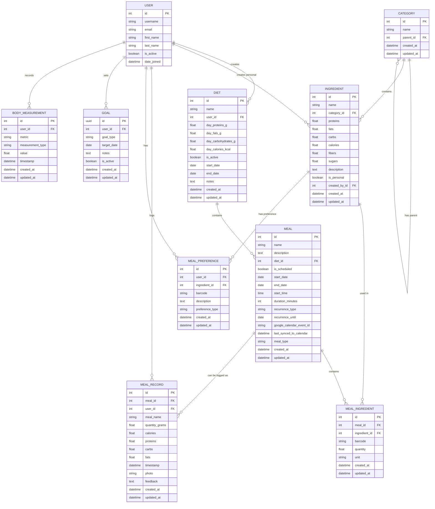

# FitHub Entity Relationship Diagram

## Database Schema Overview

This document contains the Entity Relationship (ER) diagram for the FitHub database schema, showing all entities and their relationships.

## Mermaid ER Diagram

## Entity Descriptions

### Core Entities

1. **USER**: Django's built-in User model for authentication and user management
2. **DIET**: User's dietary plans with nutritional targets
3. **MEAL**: Individual meals within a diet, with scheduling capabilities
4. **INGREDIENT**: Food items with nutritional information
5. **CATEGORY**: Hierarchical categorization of ingredients
6. **MEAL_INGREDIENT**: Junction table linking meals to ingredients with quantities
7. **MEAL_RECORD**: Logged meal consumption (planned or unplanned)
8. **MEAL_PREFERENCE**: User preferences for ingredients (love, like, dislike, etc.)
9. **GOAL**: User's fitness goals with target dates
10. **BODY_MEASUREMENT**: Physical measurements for progress tracking

### Key Relationships

- **User Ownership**: All user-specific entities have a foreign key to USER
- **Diet Hierarchy**: DIET → MEAL → MEAL_INGREDIENT → INGREDIENT
- **Category Hierarchy**: CATEGORY can have parent categories (self-referencing)
- **Meal Logging**: MEAL_RECORD can reference either a planned MEAL or be standalone
- **Ingredient Preferences**: MEAL_PREFERENCE links users to ingredients with preference types
- **Goal Tracking**: BODY_MEASUREMENT tracks progress toward GOALs

### Design Patterns

- **User Isolation**: All user data is isolated by user_id foreign keys
- **Flexible Meal Recording**: MEAL_RECORD supports both planned meals and ad-hoc logging
- **Hierarchical Categories**: Self-referencing CATEGORY model for nested categorization
- **Preference System**: MEAL_PREFERENCE allows users to express ingredient preferences
- **Goal Progress**: BODY_MEASUREMENT enables tracking progress toward fitness goals
